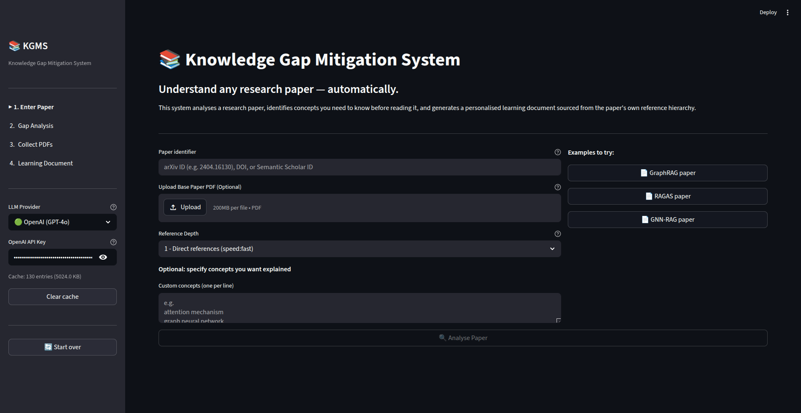

# Research Knowledge Gaps Mitigation (RKGM)

Automatically identifies what you need to know before reading a research paper, then generates a personalised, chronologically ordered learning document — sourced from the paper's own reference hierarchy.

**Based on:** Rahman et al. (2022), *An Article Recommendation Technique from a Multi-Layer Reference Article Graph for Facilitating Chronological Learning*, IEEE ICCIT. [DOI: 10.1109/ICCIT57492.2022.10103286](https://ieeexplore.ieee.org/abstract/document/10103286)

<p align="center">

</p>

---

## What It Does

1. **Phase A** — Give it any paper (arXiv ID, DOI, Semantic Scholar ID or PDF). It fetches the paper's 3-level reference graph, detects knowledge gaps using structured LLM prompting with self-consistency, and returns a ranked list of candidate papers per gap with rationale.

2. **Human checkpoint** — Review the gap list, toggle off concepts you already know, add your own. The system auto-fetches open-access PDFs via Unpaywall and arXiv.

3. **Phase B** — Ingests the PDFs, retrieves the most relevant passages per gap (hybrid dense + BM25 + cross-encoder reranking), generates a grounded explanation for each gap with inline citations, orders them chronologically, and assembles a complete learning document.

---

## Architecture

### LLM Provider Support

| Provider             | Models                                       | Notes                         |
| -------------------- | -------------------------------------------- | ----------------------------- |
| **Groq** *(default)* | Llama 3.3 70B (heavy) · Llama 3.1 8B (light) | Free tier, fast — recommended |
| **OpenAI**           | GPT-4o (heavy) · GPT-4o-mini (light)         | Higher quality, pay-per-use   |
| **Auto**             | Groq if `GROQ_API_KEY` set, else OpenAI      | Automatic fallback            |

### Retrieval Pipeline

```
Gap query
  → Dense (ChromaDB cosine, top-20)  ─┐
  → Sparse (BM25, top-20)            ─┤→ RRF merge → Cross-encoder rerank → Top-5
```

### Ordering Strategy

1. **Stage 1 (deterministic):** Foundation → Development → Frontier, then by trendscore within layer
2. **Stage 2 (LLM):** Refine within-layer order using dependency sentences
3. **Cycle resolution:** Mutual dependency → higher trendscore paper goes first

### Gap Detection

- Runs 3× at temperatures [0.1, 0.35, 0.6]
- Keeps concepts appearing in ≥ 2/3 runs (self-consistency)
- Validates each gap traces back to a specific passage in the paper

---

## Quick Start

### 1. Clone & install

```bash
git clone https://github.com/sharukhn32/Research-Knowledge-Gaps.git
cd Research-Knowledge-Gaps

# Using uv (recommended)
uv venv && source .venv/bin/activate && uv pip install -r requirements.txt

# Or plain pip
pip install -r requirements.txt
```

### 2. Configure API keys

Copy `.env.example` to `.env` and fill in your key(s):

```bash
cp .env.example .env
```

```bash
# Use Groq (free) — recommended
GROQ_API_KEY="gsk_..."

# Or OpenAI
OPENAI_API_KEY="sk-..."

# Provider: "groq" | "openai" | "auto" (default: auto)
LLM_PROVIDER="auto"
```

Get a free Groq key at [console.groq.com](https://console.groq.com).  
Get an OpenAI key at [platform.openai.com/api-keys](https://platform.openai.com/api-keys).

### 3. Run

**Web UI (recommended):**

```bash
python app.py
```

Opens the Streamlit interface automatically in your browser. The provider and API keys can also be set interactively from the sidebar — no `.env` required.

**CLI:**

```bash
# Minimal — paper ID only, abstract-level gap detection
python run.py --paper 2405.20139 --depth 0 --out ./output/

# With PDF for richer gap detection
python run.py --paper 2405.20139 --pdf /path/to/paper.pdf

# Control depth and add custom gaps
python run.py --paper 2405.20139 --pdf paper.pdf --depth 2 \
              --gaps "knowledge graph" "SPARQL"

# Phase A only (gaps + candidate list, skip generation)
python run.py --paper 2405.20139 --pdf paper.pdf --phase-a-only

# Custom output directory
python run.py --paper 2405.20139 --pdf paper.pdf --out ./results/

# Verbose logging
python run.py --paper 2405.20139 --pdf paper.pdf --verbose

# Clear API cache (force fresh Semantic Scholar calls)
python run.py --paper 2405.20139 --clear-cache
```

CLI outputs written to `--out` directory (default: current directory):

| File                       | Contents                        |
| -------------------------- | ------------------------------- |
| `learning_roadmap_<id>.md` | The generated learning document |
| `phase_a_state_<id>.json`  | Saved Phase A state (re-usable) |
| `candidates_<id>.bib`      | BibTeX for all candidate papers |
| `candidates_<id>.csv`      | PDF availability status         |

---

## Optional: Better PDF Parsing

For academic two-column layouts, install `marker-pdf`:

```bash
pip install marker-pdf
# Downloads ~1.5 GB of models on first use
```

Falls back to PyMuPDF automatically if marker-pdf is unavailable.

---

## Configuration

All tunable parameters live in `core/config.py`. The most useful ones:

```python
# ── Reference graph ────────────────────────────────────────────────────────
FOUNDATION_TOP_K     = 10     # how many papers qualify as Foundation layer
FRONTIER_YEAR_CUTOFF = 2022   # papers from this year onwards → Frontier

# ── Gap detection ──────────────────────────────────────────────────────────
SELF_CONSISTENCY_RUNS = 3     # number of LLM runs per gap detection pass
SELF_CONSISTENCY_MIN  = 2     # gap must appear in ≥ N runs to be kept
CONFIDENCE_THRESHOLD  = 0.5   # discard ungrounded gaps below this

# ── Candidate scoring ──────────────────────────────────────────────────────
ALPHA = 0.5    # semantic similarity weight
BETA  = 0.3    # trendscore weight
GAMMA = 0.2    # layer-match weight

# ── Generation ────────────────────────────────────────────────────────────
MAX_MULTIHOP_DEPTH = 2        # max recursion depth for sub-gap detection
MAX_EVAL_LOOPS     = 2        # Writing ↔ Eval agent iterations per gap
FAITHFULNESS_GATE  = 0.70     # RAGAS faithfulness minimum before retry
```

---

## Supported Paper Input Formats

| Format              | Example                                    |
| ------------------- | ------------------------------------------ |
| arXiv ID            | `2405.20139` or `arXiv:2405.20139`         |
| DOI                 | `10.1109/ICCIT57492.2022.10103286`         |
| Semantic Scholar ID | `649def34f8be52c8b66281af98ae884c09aef38b` |

---

## Citation

If you use this project, please cite the original paper it extends:

```bibtex
@inproceedings{rahman2022article,
  title     = {An Article Recommendation Technique from a Multi-Layer Reference
               Article Graph for Facilitating Chronological Learning},
  author    = {Rahman, Sharukh and Emad, Kazi Hasnayeen and Azad, Saiful
               and Mahmud, Mufti and Kaiser, M. Shamim},
  booktitle = {2022 25th International Conference on Computer and Information
               Technology (ICCIT)},
  year      = {2022},
  publisher = {IEEE},
  doi       = {10.1109/ICCIT57492.2022.10103286}
}
```
